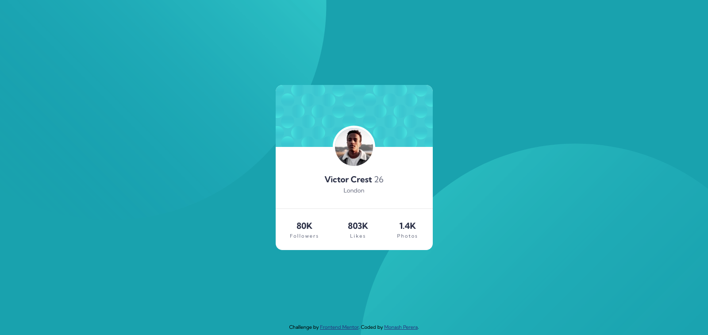
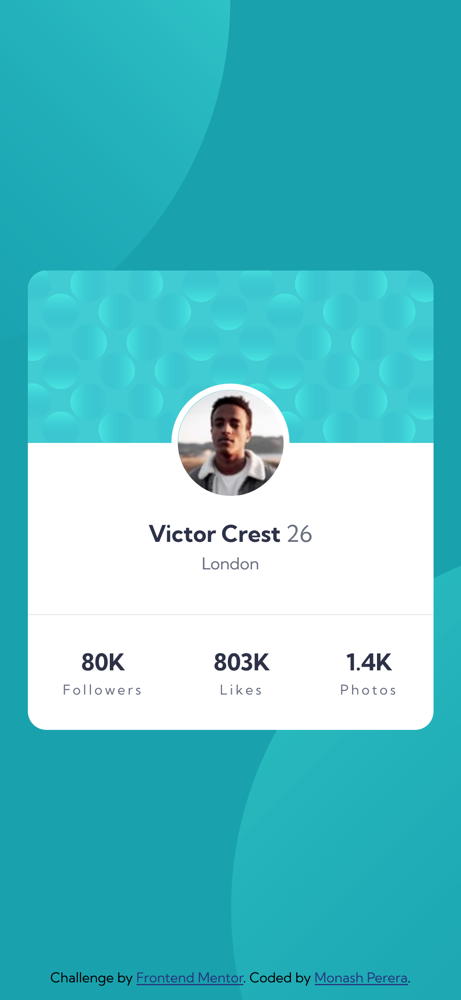

# Frontend Mentor - Profile card component solution

This is a solution to the [Profile card component challenge on Frontend Mentor](https://www.frontendmentor.io/challenges/profile-card-component-cfArpWshJ). Frontend Mentor challenges help you improve your coding skills by building realistic projects. 

## Table of contents

- [Overview](#overview)
  - [Screenshot](#screenshot)
  - [Links](#links)
- [My process](#my-process)
  - [Built with](#built-with)
  - [What I learned](#what-i-learned)
- [Author](#author)
- [Acknowledgments](#acknowledgments)

## Overview

### Screenshot


Desktop Preview



Mobile Preview


### Links
- Live Site URL:[ monashperera-qr-solution](https://monashperera-qr-frontendmentor.netlify.app/)

### Built with

- Semantic HTML5 markup
- CSS custom properties
- Flexbox
- Mobile-first workflow

### What I learned

This project thought me how to use different background image.

To see how you can add code snippets, see below:


```css
body {
    background-image: url('../images/bg-pattern-top.svg'), url('../images/bg-pattern-bottom.svg');
    background-position: left -15vw top -30vw, right -25vh bottom -72vh;
    background-repeat: no-repeat;
}
```

## Author

- Frontend Mentor - [@monashperera](https://www.frontendmentor.io/profile/monashperera)

## Acknowledgments

This is where you can give a hat tip to anyone who helped you out on this project. Perhaps you worked in a team or got some inspiration from someone else's solution. This is the perfect place to give them some credit.
